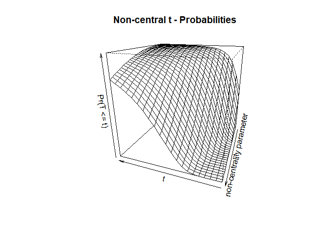
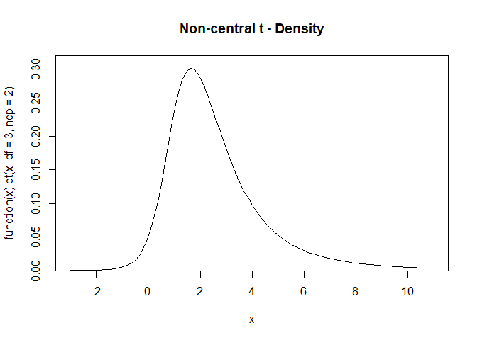

<!-- README.md is generated from README.Rmd. Please edit that file -->

# sirstochastic

<!-- badges: start -->

<!-- badges: end -->

The goal of package sirstochastic is to run simulations of single and
multiple iterations of the SIR stochastic model.

## Installation

You can install the released version of sirstochastic from
[CRAN](https://CRAN.R-project.org) with:

``` r
install.packages("sirstochastic")
install.packages("png")
```

And the development version from [GitHub](https://github.com/) with:

``` r
# install.packages("devtools")
devtools::install_github("reside-ic/sirstochastic")
```

## Equations

The equations defining the model are:

  - dS/dt = - beta \* S \* I / N
  - dI/dt = beta \* S \* I / N - sigma \* I
  - dR/dt = sigma \* I

and these are converted to the discrete stochastic model by imagining
that in a small period of time `dt` the chance of an event happening
follows a Bernoulli trial. In a discrete time step of size `dt` we model
the number of infections (i.e., the number of individuals who move from
`S` to `I`) as a binomial draw with `n = S` and `p = beta * I / N * dt`)
and the number of recoveries (movements from `I` to `R`) as a binomial
draw with `n = I` and `p = sigma * dt`. Note, N = S + I + R.

## Example

This is a basic example which shows you how to solve a common problem:

``` r
library(sirstochastic)
```

What is special about using `README.Rmd` instead of just `README.md`?
You can include R chunks like so:

``` r
summary(cars)
#>      speed           dist       
#>  Min.   : 4.0   Min.   :  2.00  
#>  1st Qu.:12.0   1st Qu.: 26.00  
#>  Median :15.0   Median : 36.00  
#>  Mean   :15.4   Mean   : 42.98  
#>  3rd Qu.:19.0   3rd Qu.: 56.00  
#>  Max.   :25.0   Max.   :120.00
```

    #> 
    #> dt> require(graphics)
    #> 
    #> dt> 1 - pt(1:5, df = 1)
    #> [1] 0.25000000 0.14758362 0.10241638 0.07797913 0.06283296
    #> 
    #> dt> qt(.975, df = c(1:10,20,50,100,1000))
    #>  [1] 12.706205  4.302653  3.182446  2.776445  2.570582  2.446912  2.364624
    #>  [8]  2.306004  2.262157  2.228139  2.085963  2.008559  1.983972  1.962339
    #> 
    #> dt> tt <- seq(0, 10, len = 21)
    #> 
    #> dt> ncp <- seq(0, 6, len = 31)
    #> 
    #> dt> ptn <- outer(tt, ncp, function(t, d) pt(t, df = 3, ncp = d))
    #> 
    #> dt> t.tit <- "Non-central t - Probabilities"
    #> 
    #> dt> image(tt, ncp, ptn, zlim = c(0,1), main = t.tit)


    #> 
    #> dt> persp(tt, ncp, ptn, zlim = 0:1, r = 2, phi = 20, theta = 200, main = t.tit,
    #> dt+       xlab = "t", ylab = "non-centrality parameter",
    #> dt+       zlab = "Pr(T <= t)")



    #> 
    #> dt> plot(function(x) dt(x, df = 3, ncp = 2), -3, 11, ylim = c(0, 0.32),
    #> dt+      main = "Non-central t - Density", yaxs = "i")

 \#\# License

    [MIT](https://choosealicense.com/licenses/mit/)

In that case, don’t forget to commit and push the resulting figure
files, so they display on GitHub\!
