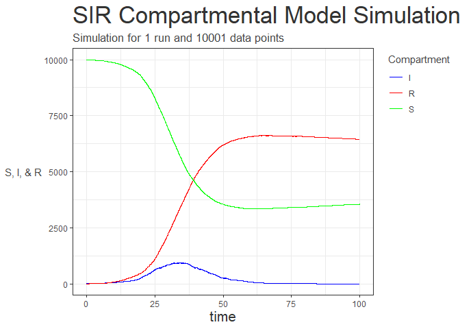
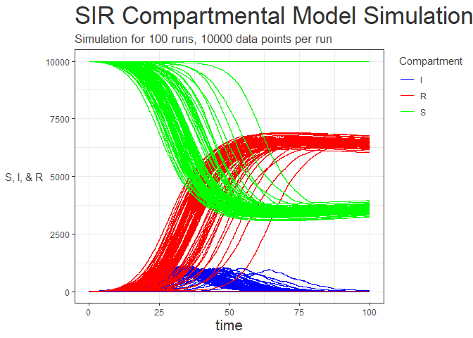

<!-- README.md is generated from README.Rmd. Please edit that file -->

# sirstochastic

<!-- badges: start -->

[](https://github.com/reside-ic/sirstochastic/actions)
<!-- badges: end -->

The goal of package sirstochastic is to run simulations of single and
multiple iterations of the SIR stochastic model.

## Installation

You can install the released version of sirstochastic from
[CRAN](https://CRAN.R-project.org) with:

``` r
install.packages("sirstochastic")
install.packages("ggplot2")
```

And the development version from [GitHub](https://github.com/) with:

``` r
# install.packages("devtools")
devtools::install_github("reside-ic/sirstochastic")
```

## Equations

The equations defining the model are:

  - dS/dt = - beta \* S \* I / N
  - dI/dt = beta \* S \* I / N - sigma \* I
  - dR/dt = sigma \* I

and these are converted to the discrete stochastic model by imagining
that in a small period of time `dt` the chance of an event happening
follows a Bernoulli trial. In a discrete time step of size `dt` we model
the number of infections (i.e., the number of individuals who move from
`S` to `I`) as a binomial draw with `n = S` and `p = beta * I / N * dt`)
and the number of recoveries (movements from `I` to `R`) as a binomial
draw with `n = I` and `p = sigma * dt`. Note, N = S + I + R.

## Example

This is a basic example which shows you how to solve a common problem.
The model is run once for 10,000 iterations with a time step of 0.01.



This time the model is run a 100 times for 10,000 iterations with a time
step of 0.01 using the same code.



## License

MIT © Imperial College of Science, Technology and Medicine
